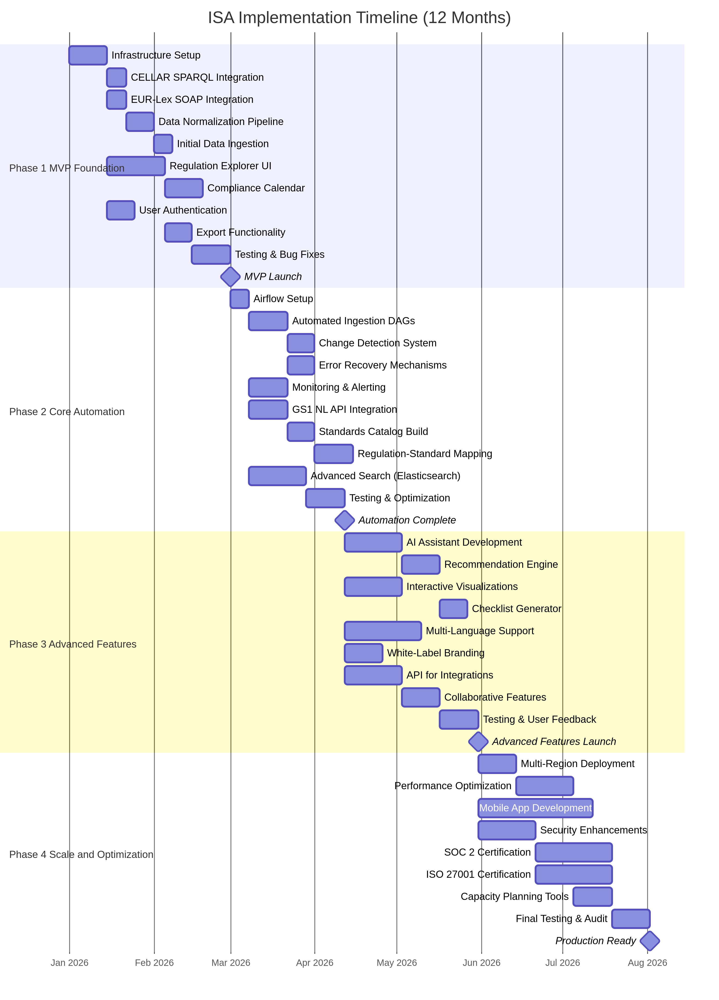
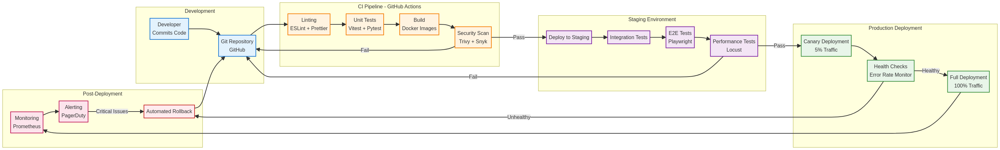
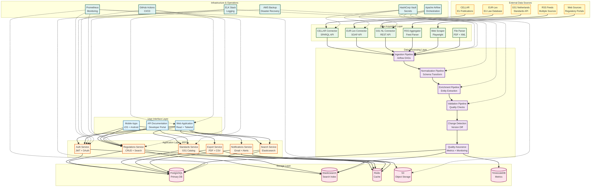
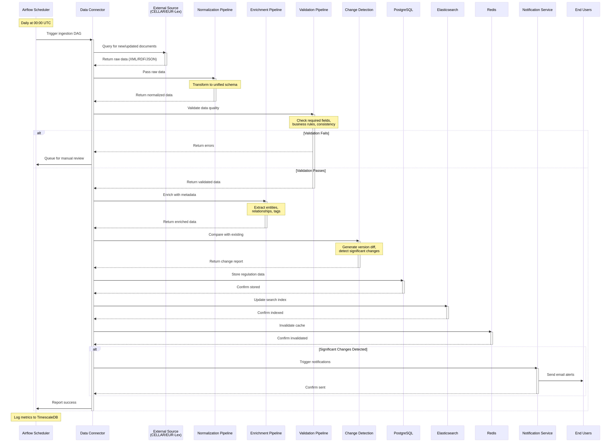

# Intelligent Standards Architect (ISA)

## Strategic Roadmap for Production-Grade Deployment

**Document Version**: 1.0  
**Date**: November 28, 2025  
**Author**: Manus AI  
**Purpose**: Comprehensive strategic plan for building, deploying, and maintaining a production-grade ISA platform with minimal manual overhead

---

## Executive Summary

The Intelligent Standards Architect (ISA) bridges the gap between rapidly evolving EU sustainability regulations and GS1 supply chain standards. This strategic roadmap defines a clear path from current prototype to production-grade platform, emphasizing automation, operational excellence, and long-term maintainability. The platform will serve as an autonomous knowledge hub that ingests, normalizes, and continuously maintains comprehensive ESG regulatory data and GS1 standards with minimal human intervention.

**Core Value Proposition**: ISA eliminates the manual burden of tracking 100+ EU regulations across multiple sources, automatically mapping them to relevant GS1 standards, and delivering actionable compliance insights to supply chain professionals—saving an estimated 20-40 hours per month per organization in regulatory monitoring.

**Strategic Priorities**:

1. **Automation First**: Design every component for autonomous operation
2. **Data Quality**: Ensure comprehensive coverage with automated validation
3. **User Value**: Prioritize features delivering immediate compliance value
4. **Operational Excellence**: Build for reliability, scalability, and minimal maintenance
5. **Modularity**: Enable incremental deployment and independent component evolution

---

## 1. Complete To-Do List for Production ISA

This section enumerates all required tasks organized by functional area, prioritized for production readiness.

### 1.1 Data Infrastructure

**Critical (MVP)**

- Implement CELLAR SPARQL client for EU regulatory data extraction
- Build EUR-Lex SOAP API integration with authentication
- Create GS1 Netherlands API integration (Basic Product Data IN API)
- Design normalized database schema for regulations, standards, and mappings
- Implement data validation and quality assurance pipelines
- Create automated data ingestion scheduler (daily/weekly)
- Build RSS feed aggregator for real-time regulatory updates

**High Priority**

- Implement change detection and versioning system
- Create data normalization layer for multiple source formats
- Build automated CELEX ID resolution and linking
- Implement full-text search indexing for regulations
- Create automated GS1 standard catalog synchronization
- Build data lineage tracking and audit logs
- Implement automated data quality metrics and monitoring

**Medium Priority**

- Create multi-language support for EU regulations (24 languages)
- Implement automated translation quality validation
- Build historical data archive and time-travel queries
- Create data export APIs for third-party integrations
- Implement automated data backup and disaster recovery

### 1.2 Automation & Orchestration

**Critical (MVP)**

- Set up Apache Airflow for workflow orchestration
- Create DAGs for daily regulatory data ingestion
- Implement automated error detection and recovery
- Build notification system for data pipeline failures
- Create automated health checks and monitoring

**High Priority**

- Implement intelligent retry logic with exponential backoff
- Create automated rate limiting and API quota management
- Build circuit breakers for failing data sources
- Implement automated schema evolution handling
- Create self-healing mechanisms for common failures
- Build automated performance optimization

**Medium Priority**

- Implement predictive maintenance for data pipelines
- Create automated capacity planning and scaling
- Build automated cost optimization for cloud resources
- Implement automated security patching and updates

### 1.3 User Interface & Experience

**Critical (MVP)**

- Enhance regulation detail pages with complete metadata
- Implement advanced search with filters and facets
- Create user dashboard with saved searches and alerts
- Build compliance calendar with deadline tracking
- Implement email notification system for updates

**High Priority**

- Create interactive regulation-to-standard mapping visualizations
- Build compliance checklist generator with progress tracking
- Implement personalized recommendation engine
- Create collaborative features (annotations, sharing)
- Build mobile-responsive design
- Implement accessibility compliance (WCAG 2.1 AA)

**Medium Priority**

- Create AI-powered compliance assistant chatbot
- Build custom report builder with templates
- Implement multi-tenant support for enterprise customers
- Create white-label customization options
- Build API documentation portal for developers

### 1.4 Testing & Quality Assurance

**Critical (MVP)**

- Expand unit test coverage to 80%+ for all modules
- Create integration tests for data pipelines
- Implement end-to-end tests for critical user flows
- Build automated regression testing suite
- Create data quality validation tests

**High Priority**

- Implement performance testing and benchmarking
- Create load testing for concurrent users
- Build chaos engineering tests for resilience
- Implement security testing (OWASP Top 10)
- Create automated accessibility testing
- Build data accuracy validation against source systems

**Medium Priority**

- Implement mutation testing for test quality
- Create property-based testing for edge cases
- Build visual regression testing for UI
- Implement contract testing for APIs
- Create synthetic monitoring for production

### 1.5 DevOps & Infrastructure

**Critical (MVP)**

- Set up CI/CD pipeline with automated deployments
- Implement infrastructure as code (Terraform/CloudFormation)
- Create staging and production environments
- Build automated database migrations
- Implement centralized logging and monitoring

**High Priority**

- Set up distributed tracing for performance analysis
- Create automated alerting and incident response
- Implement blue-green or canary deployments
- Build automated rollback mechanisms
- Create disaster recovery procedures and testing
- Implement secrets management and rotation

**Medium Priority**

- Set up multi-region deployment for high availability
- Create automated cost monitoring and optimization
- Build compliance monitoring (SOC 2, GDPR)
- Implement automated security scanning and remediation
- Create performance profiling and optimization tools

### 1.6 Documentation & Knowledge Management

**Critical (MVP)**

- Create comprehensive API documentation
- Write user guides and tutorials
- Document data sources and update frequencies
- Create runbooks for common operational tasks
- Write architectural decision records (ADRs)

**High Priority**

- Create video tutorials and onboarding materials
- Build interactive API playground
- Document troubleshooting guides
- Create data dictionary and glossary
- Write contribution guidelines for open-source components

**Medium Priority**

- Create case studies and success stories
- Build knowledge base with searchable FAQ
- Document best practices for compliance workflows
- Create training materials for administrators
- Write white papers on regulatory compliance automation

---

## 2. Development Roadmap with Clear Phases

The roadmap is structured in four phases, optimized for earliest value delivery and stable automation.



**Figure 4**: 12-month implementation timeline showing all phases, tasks, dependencies, and milestones.

### Phase 1: MVP Foundation (Months 1-3)

**Goal**: Deliver functional ESG regulation repository with basic automation

**Deliverables**:

- 31 EU regulations fully ingested and normalized
- Basic CELLAR SPARQL integration for automated updates
- User-facing regulation explorer with search and filters
- Compliance calendar with deadline tracking
- Email notification system for regulatory changes
- Basic export functionality (PDF/CSV)
- 70%+ test coverage for core modules

**Success Metrics**:

- 100% of target regulations available in system
- < 24 hour latency for new regulation updates
- 50+ active users with positive feedback
- Zero critical bugs in production
- 95% uptime SLA

**Dependencies**:

- EUR-Lex API access credentials
- CELLAR SPARQL endpoint availability
- Database infrastructure provisioned
- CI/CD pipeline operational

**Estimated Effort**: 400-500 development hours

### Phase 2: Core Automation (Months 4-6)

**Goal**: Achieve autonomous operation with minimal manual intervention

**Deliverables**:

- Apache Airflow orchestration for all data pipelines
- Automated change detection and versioning
- Self-healing error recovery mechanisms
- Comprehensive monitoring and alerting
- Automated data quality validation
- GS1 Netherlands API integration
- Regulation-to-standard mapping database
- Advanced search with full-text indexing

**Success Metrics**:

- 90%+ automation rate for data ingestion
- < 1 hour mean time to detect (MTTD) for issues
- < 4 hours mean time to recover (MTTR) from failures
- 100% of GS1 standards cataloged
- 200+ active users
- 99% uptime SLA

**Dependencies**:

- Phase 1 completion
- GS1 NL API credentials obtained
- Airflow infrastructure deployed
- Monitoring tools configured

**Estimated Effort**: 500-600 development hours

### Phase 3: Advanced Features & Intelligence (Months 7-9)

**Goal**: Deliver AI-powered insights and enterprise-grade capabilities

**Deliverables**:

- AI-powered compliance assistant
- Intelligent recommendation engine
- Interactive visualization dashboards
- Automated compliance checklist generation
- Multi-language support (priority: EN, NL, DE, FR)
- White-label branding capabilities
- API for third-party integrations
- Enhanced export with branded templates
- Collaborative features (annotations, sharing)

**Success Metrics**:

- 80%+ user satisfaction with AI recommendations
- 500+ active users
- 10+ enterprise customers
- 50%+ reduction in time-to-compliance for users
- 99.5% uptime SLA

**Dependencies**:

- Phase 2 completion
- LLM integration configured
- Translation services available
- Enterprise customer feedback incorporated

**Estimated Effort**: 600-700 development hours

### Phase 4: Scale & Optimization (Months 10-12)

**Goal**: Optimize for scale, performance, and operational excellence

**Deliverables**:

- Multi-region deployment for global availability
- Performance optimization (< 2s page load times)
- Automated capacity planning and scaling
- Predictive maintenance for data pipelines
- Comprehensive analytics and reporting
- Mobile applications (iOS/Android)
- Advanced security features (SSO, MFA, RBAC)
- Compliance certifications (SOC 2, ISO 27001)

**Success Metrics**:

- 1000+ active users
- < 500ms API response times (p95)
- 99.9% uptime SLA
- 100% automated operations (zero manual interventions)
- 95%+ data accuracy vs. source systems
- 50+ enterprise customers

**Dependencies**:

- Phase 3 completion
- Multi-region infrastructure provisioned
- Security audit completed
- Compliance certification process initiated

**Estimated Effort**: 700-800 development hours

---

## 3. Product Vision & Feature Catalog

### 3.1 Vision Statement

ISA will become the definitive platform for ESG regulatory intelligence in the supply chain industry, serving as an autonomous knowledge hub that eliminates manual compliance tracking and delivers actionable insights through AI-powered automation. The platform will maintain comprehensive, up-to-date coverage of all relevant EU regulations and GS1 standards, accessible through intuitive interfaces designed for compliance professionals, supply chain managers, and sustainability officers.

### 3.2 User Types & Personas

**Primary Users**

| User Type                    | Role                                               | Primary Goals                                            | Key Features                                       |
| ---------------------------- | -------------------------------------------------- | -------------------------------------------------------- | -------------------------------------------------- |
| **Compliance Officer**       | Ensures organizational compliance with regulations | Track deadlines, generate reports, monitor changes       | Compliance calendar, alerts, checklists, export    |
| **Supply Chain Manager**     | Manages supply chain operations and standards      | Understand GS1 standard requirements, map to regulations | Standards mapping, visualizations, recommendations |
| **Sustainability Officer**   | Drives ESG initiatives and reporting               | Monitor sustainability regulations, prepare disclosures  | Regulation explorer, search, CSRD/ESRS focus       |
| **Legal Counsel**            | Provides legal interpretation and guidance         | Access full regulation texts, track amendments           | Document viewer, version history, citations        |
| **Executive/Decision Maker** | Makes strategic compliance decisions               | High-level overview, risk assessment                     | Dashboard, analytics, summary reports              |

**Secondary Users**

| User Type         | Role                                  | Primary Goals                                   | Key Features                                    |
| ----------------- | ------------------------------------- | ----------------------------------------------- | ----------------------------------------------- |
| **Administrator** | Manages platform and users            | Configure system, manage access, monitor health | Admin panel, user management, system monitoring |
| **Data Analyst**  | Analyzes compliance data and trends   | Extract data, create custom reports             | API access, data export, query builder          |
| **Consultant**    | Advises clients on compliance         | Access multi-client data, create presentations  | Multi-tenant access, white-label reports        |
| **Researcher**    | Studies regulatory trends and impacts | Bulk data access, historical analysis           | API, bulk export, time-series queries           |

### 3.3 Complete Feature Catalog

**Core Features (MVP)**

1. **Regulation Repository**
   - 31+ EU ESG regulations with complete metadata
   - Full-text search with filters (type, status, sector, date)
   - Regulation detail pages with timeline, requirements, FAQs
   - CELEX ID linking and cross-references
   - Document download (official texts)

2. **Compliance Calendar**
   - Deadline tracking for all regulations
   - Visual timeline with milestones
   - Filtering by regulation, sector, priority
   - Email reminders for upcoming deadlines
   - Export to calendar applications (iCal)

3. **News & Updates Feed**
   - Automated RSS aggregation from regulatory sources
   - AI-powered relevance filtering
   - Categorization by regulation and topic
   - Email digest (daily/weekly)
   - Saved searches and alerts

4. **Export Functionality**
   - PDF export with formatted layouts
   - CSV export for data analysis
   - Bulk export for multiple regulations
   - Customizable templates
   - Branded exports for white-label

5. **User Management**
   - Authentication with OAuth (Manus Auth)
   - User profiles and preferences
   - Saved searches and bookmarks
   - Activity history
   - Email notification settings

**Advanced Features (Phase 2-3)**

6. **GS1 Standards Mapping**
   - Complete catalog of GS1 standards
   - Automated mapping to relevant regulations
   - Interactive visualization of relationships
   - Impact analysis for standards changes
   - Recommendation engine for applicable standards

7. **AI-Powered Compliance Assistant**
   - Natural language Q&A about regulations
   - Contextual recommendations
   - Compliance gap analysis
   - Automated checklist generation
   - Risk assessment and prioritization

8. **Collaboration Features**
   - Annotations and notes on regulations
   - Sharing with team members
   - Discussion threads
   - Task assignment and tracking
   - Collaborative checklists

9. **Analytics & Reporting**
   - Compliance dashboard with KPIs
   - Trend analysis and forecasting
   - Custom report builder
   - Scheduled report delivery
   - Visualization library (charts, graphs)

10. **API & Integrations**
    - RESTful API for programmatic access
    - Webhook notifications for updates
    - Third-party integrations (Slack, Teams, etc.)
    - Data export API
    - Developer documentation portal

**Enterprise Features (Phase 3-4)**

11. **Multi-Tenant Support**
    - Organization-level accounts
    - Role-based access control (RBAC)
    - Team management
    - Usage analytics per tenant
    - Custom branding per tenant

12. **Advanced Security**
    - Single Sign-On (SSO) with SAML/OAuth
    - Multi-Factor Authentication (MFA)
    - Audit logging
    - Data encryption at rest and in transit
    - Compliance certifications (SOC 2, ISO 27001)

13. **Mobile Applications**
    - iOS and Android native apps
    - Offline access to saved content
    - Push notifications
    - Mobile-optimized UI
    - Sync across devices

14. **Multi-Language Support**
    - 24 EU official languages
    - Automated translation with quality validation
    - Language-specific search
    - Localized UI and content
    - Translation memory for consistency

15. **Advanced Automation**
    - Predictive compliance alerts
    - Automated workflow triggers
    - Integration with compliance management systems
    - Automated report generation
    - AI-powered content summarization

### 3.4 Quality Standards

**Data Quality**

- **Accuracy**: 95%+ match with official sources
- **Completeness**: 100% coverage of target regulations
- **Timeliness**: < 24 hours for updates
- **Consistency**: Standardized formats across sources
- **Validation**: Automated quality checks on all ingested data

**System Quality**

- **Availability**: 99.9% uptime SLA
- **Performance**: < 2s page load times, < 500ms API response (p95)
- **Scalability**: Support 10,000+ concurrent users
- **Security**: OWASP Top 10 compliance, regular penetration testing
- **Reliability**: < 0.1% error rate for data pipelines

**User Experience**

- **Usability**: 80%+ user satisfaction score
- **Accessibility**: WCAG 2.1 AA compliance
- **Responsiveness**: Mobile-first design
- **Intuitiveness**: < 5 minutes time-to-value for new users
- **Support**: < 4 hour response time for critical issues

---

## 4. Value-Per-Cost Analysis

This section evaluates each feature based on user value delivered versus implementation cost and ongoing maintenance overhead.

### 4.1 Value Framework

**Value Dimensions**:

- **Time Saved**: Hours saved per user per month
- **Compliance Risk Reduction**: Percentage reduction in compliance gaps
- **User Adoption**: Expected usage frequency and user base
- **Competitive Differentiation**: Uniqueness vs. alternatives
- **Revenue Potential**: Monetization opportunity

**Cost Dimensions**:

- **Development Effort**: Initial implementation hours
- **Maintenance Overhead**: Ongoing monthly hours
- **Infrastructure Cost**: Monthly cloud/service costs
- **Operational Complexity**: Manual intervention requirements
- **Technical Debt**: Long-term sustainability concerns

### 4.2 Feature Prioritization Matrix

| Feature                       | User Value | Dev Cost  | Maintenance | Value/Cost Ratio | Priority |
| ----------------------------- | ---------- | --------- | ----------- | ---------------- | -------- |
| **Regulation Repository**     | Very High  | Medium    | Low         | 9/10             | Critical |
| **CELLAR SPARQL Integration** | Very High  | High      | Low         | 8/10             | Critical |
| **Compliance Calendar**       | High       | Low       | Low         | 9/10             | Critical |
| **Email Notifications**       | High       | Low       | Low         | 9/10             | Critical |
| **Export (PDF/CSV)**          | High       | Medium    | Low         | 8/10             | Critical |
| **Automated Updates (RSS)**   | Very High  | Medium    | Low         | 9/10             | Critical |
| **GS1 Standards Mapping**     | Very High  | High      | Medium      | 7/10             | High     |
| **AI Compliance Assistant**   | High       | Very High | Medium      | 6/10             | High     |
| **Advanced Search**           | High       | Medium    | Low         | 8/10             | High     |
| **Change Detection**          | High       | Medium    | Low         | 8/10             | High     |
| **Collaboration Features**    | Medium     | High      | Medium      | 5/10             | Medium   |
| **Analytics Dashboard**       | Medium     | Medium    | Low         | 6/10             | Medium   |
| **Multi-Language Support**    | Medium     | Very High | High        | 4/10             | Medium   |
| **Mobile Apps**               | Low        | Very High | High        | 3/10             | Low      |
| **White-Label Branding**      | Medium     | Medium    | Low         | 6/10             | Medium   |

### 4.3 ROI Analysis

**Baseline Scenario** (Manual Compliance Tracking):

- 20-40 hours/month per organization monitoring regulations
- Average compliance officer hourly rate: €75-100
- Monthly cost per organization: €1,500-4,000
- Risk of non-compliance: 10-20% probability, €10,000-100,000 penalty

**ISA Value Proposition**:

- Reduces manual monitoring to < 2 hours/month (95% reduction)
- Monthly time savings: 18-38 hours
- Monthly cost savings: €1,350-3,800
- Reduces compliance risk by 80% through automated alerts
- Annual ROI per organization: €16,200-45,600

**Break-Even Analysis**:

- Development cost (Phase 1-2): €80,000-120,000
- Monthly operational cost: €2,000-5,000
- Required customers for break-even (at €200/month): 10-25
- Time to break-even: 6-12 months

---

## 5. Automated Data Ingestion & Normalization

### 5.1 Data Sources Overview

**Primary Sources**

| Source                   | Type                    | Coverage                   | Update Frequency | Access Method  | Automation Level |
| ------------------------ | ----------------------- | -------------------------- | ---------------- | -------------- | ---------------- |
| **CELLAR**               | Semantic Repository     | All EU legislation         | Real-time        | SPARQL API     | Fully Automated  |
| **EUR-Lex**              | Legal Database          | EU regulations, directives | Daily            | SOAP API + RSS | Fully Automated  |
| **GS1 Netherlands**      | Standards Database      | GS1 NL standards           | Weekly           | REST API       | Fully Automated  |
| **GS1 Global**           | Standards Database      | Global GS1 standards       | Monthly          | Web Scraping   | Semi-Automated   |
| **European Commission**  | Regulatory Portal       | Proposals, consultations   | Daily            | RSS + Scraping | Semi-Automated   |
| **National Authorities** | Implementation Trackers | National transposition     | Weekly           | Web Scraping   | Semi-Automated   |

**Secondary Sources**

| Source                    | Type                  | Coverage              | Update Frequency | Access Method | Automation Level |
| ------------------------- | --------------------- | --------------------- | ---------------- | ------------- | ---------------- |
| **ESMA**                  | Financial Regulations | ESG finance rules     | Weekly           | RSS + API     | Fully Automated  |
| **EBA**                   | Banking Regulations   | Sustainable finance   | Weekly           | RSS + API     | Fully Automated  |
| **EIOPA**                 | Insurance Regulations | ESG insurance         | Weekly           | RSS + API     | Fully Automated  |
| **EFRAG**                 | Accounting Standards  | ESRS standards        | Monthly          | Web Scraping  | Semi-Automated   |
| **Industry Associations** | Guidance Documents    | Implementation guides | Ad-hoc           | RSS           | Manual Review    |

### 5.2 Data Ingestion Architecture

**Layer 1: Source Connectors**

Each data source has a dedicated connector implementing a standardized interface:

```python
class DataSourceConnector:
    def fetch_updates(self, since: datetime) -> List[RawDocument]
    def fetch_document(self, identifier: str) -> RawDocument
    def validate_connection(self) -> bool
    def get_metadata(self) -> SourceMetadata
```

**Connector Types**:

1. **API Connectors**: CELLAR SPARQL, EUR-Lex SOAP, GS1 REST APIs
2. **RSS Connectors**: Feed aggregation with deduplication
3. **Web Scrapers**: Playwright-based for dynamic content
4. **File Parsers**: PDF, XML, HTML, JSON processors

**Layer 2: Data Normalization**

All ingested data is transformed into a unified schema:

```json
{
  "document_id": "uuid",
  "source": "cellar|eurlex|gs1nl|...",
  "source_identifier": "CELEX:32022L0464",
  "document_type": "regulation|directive|standard|...",
  "title": "Corporate Sustainability Reporting Directive",
  "description": "...",
  "effective_date": "2024-01-01",
  "enforcement_date": "2025-01-01",
  "status": "active|proposed|repealed",
  "content": {
    "full_text": "...",
    "sections": [...],
    "annexes": [...]
  },
  "metadata": {
    "language": "en",
    "version": "1.0",
    "last_updated": "2025-11-28T10:00:00Z"
  },
  "relationships": {
    "amends": ["CELEX:..."],
    "related_to": ["CELEX:..."],
    "implemented_by": ["national_law_id"]
  }
}
```

**Layer 3: Data Enrichment**

Automated enrichment processes:

1. **Entity Extraction**: Identify sectors, standards, deadlines
2. **Relationship Mapping**: Link regulations to standards
3. **Semantic Tagging**: Apply EuroVoc and custom taxonomies
4. **Change Detection**: Compare versions and generate diffs
5. **Quality Scoring**: Assess completeness and accuracy

**Layer 4: Data Validation**

Multi-stage validation pipeline:

1. **Schema Validation**: Ensure all required fields present
2. **Business Rule Validation**: Check logical consistency
3. **Cross-Reference Validation**: Verify links and relationships
4. **Quality Metrics**: Calculate completeness, accuracy scores
5. **Manual Review Queue**: Flag anomalies for human review

### 5.3 Continuous Maintenance Strategy

**Automated Monitoring**:

- Health checks every 5 minutes for all data sources
- Automated alerts for source unavailability or errors
- Performance metrics tracking (latency, throughput)
- Data quality dashboards with real-time metrics

**Change Management**:

- Version control for all ingested documents
- Automated change detection with diff generation
- Notification system for significant changes
- Rollback capability for erroneous updates

**Schema Evolution**:

- Backward-compatible schema changes
- Automated migration scripts for database updates
- Validation of schema changes against test data
- Gradual rollout with canary deployments

**Data Lifecycle Management**:

- Automated archival of superseded versions
- Retention policies for historical data
- Automated cleanup of deprecated content
- Backup and disaster recovery procedures

---

## 6. Automated Data Acquisition Strategy

### 6.1 API-First Approach

**CELLAR SPARQL** (Primary for EU Legislation)

**Advantages**:

- Structured semantic data (RDF)
- Powerful query capabilities
- Real-time access to latest data
- No rate limits for reasonable usage
- Official EU source with high reliability

**Implementation**:

```python
# Daily full sync query
QUERY = """
PREFIX cdm: <http://publications.europa.eu/ontology/cdm#>
PREFIX skos: <http://www.w3.org/2004/02/skos/core#>

SELECT ?regulation ?title ?date ?celex WHERE {
  ?regulation a cdm:regulation ;
              cdm:work_date_document ?date ;
              cdm:resource_legal_id_celex ?celex ;
              skos:prefLabel ?title .
  FILTER(?date >= "2020-01-01"^^xsd:date)
  FILTER(lang(?title) = "en")
}
ORDER BY DESC(?date)
```

**Resilience Strategy**:

- Implement exponential backoff for transient failures
- Cache query results for 24 hours
- Fallback to EUR-Lex SOAP if SPARQL unavailable
- Monitor endpoint health and switch automatically

**EUR-Lex SOAP API** (Backup for EU Legislation)

**Advantages**:

- Comprehensive metadata
- Expert search capabilities
- Full-text search support
- Official EU source

**Challenges**:

- Requires registration
- SOAP protocol complexity
- XML parsing overhead

**Implementation**:

- Register for API access with Publications Office
- Implement SOAP client with WSDL parsing
- Use for gap-filling when CELLAR data incomplete
- Scheduled daily sync for new documents

**GS1 Netherlands API** (Primary for GS1 Standards)

**Advantages**:

- Direct access to GS1 NL standards
- REST API with JSON responses
- Bulk data retrieval support

**Challenges**:

- Requires API credentials
- May have rate limits
- Limited to Netherlands-specific data

**Implementation**:

- Obtain API credentials from GS1 NL
- Implement OAuth 2.0 authentication
- Weekly sync for standards catalog
- Incremental updates based on last-modified headers

### 6.2 RSS Feed Aggregation

**Strategy**: Subscribe to RSS feeds from all relevant sources for real-time updates

**Feed Sources**:

1. EUR-Lex: New legislation by topic
2. European Commission: Press releases and proposals
3. ESMA, EBA, EIOPA: Regulatory updates
4. GS1 Global: Standards announcements
5. Industry associations: Guidance and commentary

**Implementation**:

```python
class RSSAggregator:
    def __init__(self, feeds: List[FeedConfig]):
        self.feeds = feeds
        self.seen_items = set()  # Deduplication

    def poll_feeds(self) -> List[FeedItem]:
        new_items = []
        for feed in self.feeds:
            try:
                parsed = feedparser.parse(feed.url)
                for entry in parsed.entries:
                    item_id = self.generate_item_id(entry)
                    if item_id not in self.seen_items:
                        new_items.append(self.normalize_entry(entry))
                        self.seen_items.add(item_id)
            except Exception as e:
                logger.error(f"Failed to fetch {feed.url}: {e}")
        return new_items
```

**Resilience Features**:

- Retry failed feeds with exponential backoff
- Deduplication across feeds
- Content fingerprinting for change detection
- Automated feed health monitoring

### 6.3 Web Scraping Strategy

**Use Cases**:

- Sources without APIs (national authorities, EFRAG)
- Supplementary content (implementation guides)
- Validation against official websites

**Technology Stack**:

- **Playwright**: Browser automation for dynamic content
- **BeautifulSoup**: HTML parsing
- **Scrapy**: Scalable crawling framework
- **Selenium Grid**: Distributed scraping

**Anti-Scraping Mitigation**:

1. **Respectful Crawling**:
   - Obey robots.txt
   - Implement rate limiting (1-2 requests/second)
   - Use appropriate User-Agent headers
   - Crawl during off-peak hours

2. **Resilience Techniques**:
   - Rotate User-Agent strings
   - Implement request delays with jitter
   - Use residential proxies if necessary
   - Implement CAPTCHA detection and manual fallback

3. **Change Detection**:
   - Store content hashes
   - Compare against previous versions
   - Only process changed content
   - Minimize redundant requests

**Example Scraper**:

```python
from playwright.async_api import async_playwright

class RegulatoryWebScraper:
    async def scrape_page(self, url: str) -> ScrapedContent:
        async with async_playwright() as p:
            browser = await p.chromium.launch()
            page = await browser.new_page()

            try:
                await page.goto(url, wait_until="networkidle")
                await page.wait_for_selector(".content", timeout=10000)

                content = await page.inner_text(".content")
                metadata = await self.extract_metadata(page)

                return ScrapedContent(
                    url=url,
                    content=content,
                    metadata=metadata,
                    scraped_at=datetime.now()
                )
            finally:
                await browser.close()
```

### 6.4 Format Handling Strategy

**Supported Formats**:

- **XML**: EUR-Lex SOAP responses, GDSN data
- **RDF/Turtle**: CELLAR SPARQL results
- **JSON**: REST APIs, modern web services
- **HTML**: Web scraping, EUR-Lex pages
- **PDF**: Official regulation texts
- **Excel/CSV**: Data exports, standards catalogs

**Parsing Strategy**:

- Dedicated parser for each format
- Unified output schema
- Error handling with fallback to manual review
- Validation against expected structure

**PDF Extraction**:

```python
from pdf2image import convert_from_path
import pytesseract

class PDFExtractor:
    def extract_text(self, pdf_path: str) -> str:
        try:
            # Try text extraction first
            text = self.extract_text_layer(pdf_path)
            if self.is_valid_text(text):
                return text

            # Fallback to OCR for scanned PDFs
            return self.ocr_extract(pdf_path)
        except Exception as e:
            logger.error(f"PDF extraction failed: {e}")
            return ""

    def ocr_extract(self, pdf_path: str) -> str:
        images = convert_from_path(pdf_path)
        text = ""
        for image in images:
            text += pytesseract.image_to_string(image)
        return text
```

### 6.5 Rate Limiting & Quota Management

**Strategy**: Implement intelligent rate limiting to respect API quotas and avoid bans

**Implementation**:

```python
from ratelimit import limits, sleep_and_retry

class RateLimitedAPIClient:
    @sleep_and_retry
    @limits(calls=100, period=60)  # 100 calls per minute
    def make_request(self, endpoint: str) -> Response:
        return requests.get(endpoint)

    def adaptive_rate_limit(self, response: Response):
        """Adjust rate based on response headers"""
        if "X-RateLimit-Remaining" in response.headers:
            remaining = int(response.headers["X-RateLimit-Remaining"])
            if remaining < 10:
                time.sleep(5)  # Slow down when approaching limit
```

**Quota Tracking**:

- Monitor API usage against quotas
- Automated alerts when approaching limits
- Prioritize critical data sources
- Implement request queuing for non-urgent updates

---

## 7. Autonomous Operation Design

### 7.1 Self-Healing Architecture

**Automated Error Recovery**:

1. **Transient Failures**: Automatic retry with exponential backoff
2. **Data Source Unavailability**: Fallback to alternative sources
3. **Parsing Errors**: Queue for manual review, continue processing
4. **Database Deadlocks**: Automatic retry with jitter
5. **Network Timeouts**: Increase timeout and retry

**Circuit Breaker Pattern**:

```python
class CircuitBreaker:
    def __init__(self, failure_threshold=5, timeout=60):
        self.failure_count = 0
        self.failure_threshold = failure_threshold
        self.timeout = timeout
        self.last_failure_time = None
        self.state = "CLOSED"  # CLOSED, OPEN, HALF_OPEN

    def call(self, func, *args, **kwargs):
        if self.state == "OPEN":
            if time.time() - self.last_failure_time > self.timeout:
                self.state = "HALF_OPEN"
            else:
                raise CircuitBreakerOpenError()

        try:
            result = func(*args, **kwargs)
            self.on_success()
            return result
        except Exception as e:
            self.on_failure()
            raise e

    def on_success(self):
        self.failure_count = 0
        self.state = "CLOSED"

    def on_failure(self):
        self.failure_count += 1
        self.last_failure_time = time.time()
        if self.failure_count >= self.failure_threshold:
            self.state = "OPEN"
```

### 7.2 Automated Monitoring & Alerting

**Monitoring Layers**:

1. **Infrastructure Monitoring**:
   - Server health (CPU, memory, disk)
   - Database performance (queries, connections)
   - Network latency and throughput
   - Cloud resource utilization

2. **Application Monitoring**:
   - Request rates and response times
   - Error rates by endpoint
   - User activity metrics
   - Background job status

3. **Data Pipeline Monitoring**:
   - Ingestion success rates
   - Data quality metrics
   - Processing latency
   - Source availability

4. **Business Metrics**:
   - Regulation coverage completeness
   - Update latency (time from source to system)
   - User engagement metrics
   - Compliance alert delivery rates

**Alerting Strategy**:

| Alert Type                | Severity | Threshold      | Response                                   |
| ------------------------- | -------- | -------------- | ------------------------------------------ |
| **Data Source Down**      | Critical | > 1 hour       | Automated failover, immediate notification |
| **High Error Rate**       | Critical | > 5%           | Automated rollback, immediate notification |
| **Data Quality Drop**     | High     | < 90% accuracy | Queue for review, notify data team         |
| **Slow Response Times**   | Medium   | > 3s p95       | Automated scaling, notify ops team         |
| **Low Disk Space**        | High     | < 20% free     | Automated cleanup, notify ops team         |
| **Failed Background Job** | Medium   | Any failure    | Automated retry, notify if persistent      |

**Alert Channels**:

- Email for non-urgent alerts
- Slack/Teams for medium-priority alerts
- PagerDuty for critical alerts requiring immediate response
- Dashboard for real-time visibility

### 7.3 Automated Scaling

**Horizontal Scaling**:

- Auto-scaling groups for web servers (scale on CPU > 70%)
- Read replicas for database (scale on connection count)
- Worker pool scaling for background jobs (scale on queue depth)

**Vertical Scaling**:

- Automated database instance upgrades during low-traffic periods
- Cache size adjustments based on hit rates

**Cost Optimization**:

- Scheduled scaling down during off-peak hours
- Spot instances for non-critical workloads
- Automated resource cleanup (unused volumes, snapshots)

### 7.4 Automated Deployment & Rollback

**CI/CD Pipeline**:



**Figure 3**: Continuous integration and deployment pipeline with automated testing, canary deployments, and rollback capabilities.

```1. **Code Commit** → Automated tests run
2. **Tests Pass** → Build Docker images
3. **Images Built** → Deploy to staging
4. **Staging Tests Pass** → Deploy to production (canary)
5. **Canary Healthy** → Full production rollout
6. **Health Checks Fail** → Automated rollback

**Deployment Strategy**:
- Blue-green deployments for zero-downtime
- Canary releases (5% → 25% → 100% traffic)
- Automated health checks at each stage
- Automatic rollback on error rate increase

**Database Migrations**:
- Automated schema migrations with Alembic/Flyway
- Backward-compatible changes only
- Automated backup before migration
- Automated rollback on migration failure

---

## 8. System Architecture & Component Design

### 8.1 High-Level Architecture



**Figure 1**: ISA system architecture showing all major components and their interactions across six layers: User Interface, Application, Data Processing, Data Acquisition, Storage, and Infrastructure.

```

┌─────────────────────────────────────────────────────────────────┐
│ User Interface Layer │
│ ┌──────────────┐ ┌──────────────┐ ┌──────────────┐ │
│ │ Web App │ │ Mobile App │ │ API Portal │ │
│ │ (React) │ │ (Native) │ │ (Docs) │ │
│ └──────────────┘ └──────────────┘ └──────────────┘ │
└─────────────────────────────────────────────────────────────────┘
│
▼
┌─────────────────────────────────────────────────────────────────┐
│ Application Layer (tRPC) │
│ ┌──────────────┐ ┌──────────────┐ ┌──────────────┐ │
│ │ Auth │ │ Regulations │ │ Standards │ │
│ │ Service │ │ Service │ │ Service │ │
│ └──────────────┘ └──────────────┘ └──────────────┘ │
│ ┌──────────────┐ ┌──────────────┐ ┌──────────────┐ │
│ │ Search │ │ Export │ │ Notifications│ │
│ │ Service │ │ Service │ │ Service │ │
│ └──────────────┘ └──────────────┘ └──────────────┘ │
└─────────────────────────────────────────────────────────────────┘
│
▼
┌─────────────────────────────────────────────────────────────────┐
│ Data Processing Layer │
│ ┌──────────────┐ ┌──────────────┐ ┌──────────────┐ │
│ │ Ingestion │ │ Normalization│ │ Enrichment │ │
│ │ Pipeline │ │ Pipeline │ │ Pipeline │ │
│ └──────────────┘ └──────────────┘ └──────────────┘ │
│ ┌──────────────┐ ┌──────────────┐ ┌──────────────┐ │
│ │ Validation │ │ Change │ │ Quality │ │
│ │ Pipeline │ │ Detection │ │ Assurance │ │
│ └──────────────┘ └──────────────┘ └──────────────┘ │
└─────────────────────────────────────────────────────────────────┘
│
▼
┌─────────────────────────────────────────────────────────────────┐
│ Data Acquisition Layer │
│ ┌──────────────┐ ┌──────────────┐ ┌──────────────┐ │
│ │ CELLAR │ │ EUR-Lex │ │ GS1 NL │ │
│ │ Connector │ │ Connector │ │ Connector │ │
│ └──────────────┘ └──────────────┘ └──────────────┘ │
│ ┌──────────────┐ ┌──────────────┐ ┌──────────────┐ │
│ │ RSS │ │ Web │ │ File │ │
│ │ Aggregator │ │ Scraper │ │ Parser │ │
│ └──────────────┘ └──────────────┘ └──────────────┘ │
└─────────────────────────────────────────────────────────────────┘
│
▼
┌─────────────────────────────────────────────────────────────────┐
│ Storage Layer │
│ ┌──────────────┐ ┌──────────────┐ ┌──────────────┐ │
│ │ PostgreSQL │ │ Elasticsearch│ │ S3 Object │ │
│ │ (Primary DB)│ │ (Search) │ │ Storage │ │
│ └──────────────┘ └──────────────┘ └──────────────┘ │
│ ┌──────────────┐ ┌──────────────┐ │
│ │ Redis │ │ TimescaleDB │ │
│ │ (Cache) │ │ (Metrics) │ │
│ └──────────────┘ └──────────────┘ │
└─────────────────────────────────────────────────────────────────┘
│
▼
┌─────────────────────────────────────────────────────────────────┐
│ Infrastructure & Operations │
│ ┌──────────────┐ ┌──────────────┐ ┌──────────────┐ │
│ │ Airflow │ │ Monitoring │ │ Logging │ │
│ │ (Orchestration)│ (Prometheus) │ │ (ELK Stack) │ │
│ └──────────────┘ └──────────────┘ └──────────────┘ │
│ ┌──────────────┐ ┌──────────────┐ ┌──────────────┐ │
│ │ CI/CD │ │ Secrets │ │ Backup │ │
│ │ (GitHub │ │ Management │ │ & Recovery │ │
│ │ Actions) │ │ (Vault) │ │ │ │
│ └──────────────┘ └──────────────┘ └──────────────┘ │
└─────────────────────────────────────────────────────────────────┘

```

### 8.2 Component Specifications

**Data Acquisition Layer**

| Component | Technology | Purpose | Interfaces |
|-----------|------------|---------|------------|
| **CELLAR Connector** | Python + SPARQLWrapper | Query CELLAR SPARQL endpoint | `fetch_regulations()`, `fetch_by_celex()` |
| **EUR-Lex Connector** | Python + Zeep (SOAP) | Query EUR-Lex API | `search_documents()`, `get_metadata()` |
| **GS1 NL Connector** | Python + Requests | Query GS1 NL API | `fetch_standards()`, `get_standard_details()` |
| **RSS Aggregator** | Python + Feedparser | Aggregate RSS feeds | `poll_feeds()`, `get_new_items()` |
| **Web Scraper** | Python + Playwright | Scrape web sources | `scrape_page()`, `extract_content()` |
| **File Parser** | Python + PyPDF2, lxml | Parse documents | `parse_pdf()`, `parse_xml()`, `parse_html()` |

**Data Processing Layer**

| Component | Technology | Purpose | Interfaces |
|-----------|------------|---------|------------|
| **Ingestion Pipeline** | Apache Airflow DAGs | Orchestrate data ingestion | Airflow operators |
| **Normalization Pipeline** | Python + Pydantic | Transform to unified schema | `normalize()`, `validate_schema()` |
| **Enrichment Pipeline** | Python + spaCy, LLM | Extract entities, relationships | `enrich()`, `extract_entities()` |
| **Validation Pipeline** | Python + Great Expectations | Validate data quality | `validate()`, `generate_report()` |
| **Change Detection** | Python + DeepDiff | Detect document changes | `compare_versions()`, `generate_diff()` |
| **Quality Assurance** | Python + Pandas | Calculate quality metrics | `calculate_metrics()`, `generate_dashboard()` |

**Application Layer**

| Component | Technology | Purpose | Interfaces |
|-----------|------------|---------|------------|
| **Auth Service** | tRPC + JWT | User authentication | `login()`, `logout()`, `me()` |
| **Regulations Service** | tRPC + Drizzle ORM | Regulation CRUD | `getRegulations()`, `getById()`, `search()` |
| **Standards Service** | tRPC + Drizzle ORM | Standards CRUD | `getStandards()`, `mapToRegulation()` |
| **Search Service** | tRPC + Elasticsearch | Full-text search | `search()`, `suggest()`, `facets()` |
| **Export Service** | tRPC + jsPDF | Generate exports | `exportToPDF()`, `exportToCSV()` |
| **Notifications Service** | tRPC + SendGrid | Send notifications | `sendEmail()`, `createAlert()` |

**Storage Layer**

| Component | Technology | Purpose | Schema |
|-----------|------------|---------|--------|
| **PostgreSQL** | PostgreSQL 15 | Primary relational database | Regulations, standards, users, mappings |
| **Elasticsearch** | Elasticsearch 8 | Full-text search index | Regulation documents, standards |
| **Redis** | Redis 7 | Caching and session storage | Query cache, session data |
| **S3** | AWS S3 / Manus Storage | Object storage | PDFs, exports, backups |
| **TimescaleDB** | TimescaleDB extension | Time-series metrics | Data quality metrics, usage analytics |

**Infrastructure Layer**

| Component | Technology | Purpose | Configuration |
|-----------|------------|---------|---------------|
| **Apache Airflow** | Airflow 2.7 | Workflow orchestration | DAGs for data pipelines |
| **Prometheus** | Prometheus + Grafana | Metrics and monitoring | Dashboards for system health |
| **ELK Stack** | Elasticsearch, Logstash, Kibana | Centralized logging | Application and system logs |
| **GitHub Actions** | CI/CD | Automated testing and deployment | Build, test, deploy workflows |
| **HashiCorp Vault** | Secrets management | Store API keys, credentials | Encrypted secret storage |
| **AWS Backup** | Backup service | Automated backups | Daily backups with 30-day retention |

### 8.3 Data Flow Diagrams

**Regulation Ingestion Flow**:



**Figure 2**: Automated data ingestion flow showing the complete pipeline from external sources through validation to storage and user notification.

```

1. Airflow Scheduler triggers daily ingestion DAG
2. CELLAR Connector queries SPARQL endpoint for new regulations
3. Raw data passed to Normalization Pipeline
4. Normalized data validated by Validation Pipeline
5. Enrichment Pipeline extracts entities and relationships
6. Change Detection compares with existing versions
7. Data stored in PostgreSQL
8. Search index updated in Elasticsearch
9. Notifications sent to subscribed users
10. Quality metrics recorded in TimescaleDB

```

**User Search Flow**:
```

1. User enters search query in web app
2. tRPC Search Service receives request
3. Query sent to Elasticsearch with filters
4. Results retrieved and ranked
5. PostgreSQL queried for additional metadata
6. Redis cache checked for frequently accessed data
7. Results returned to user with facets
8. User interaction logged for analytics

```

**Export Generation Flow**:
```

1. User requests PDF export for regulation
2. Export Service checks cache for pre-generated PDF
3. If not cached, retrieves regulation data from PostgreSQL
4. Applies branding configuration from user settings
5. Generates PDF using jsPDF with branded template
6. Uploads PDF to S3 for caching
7. Returns download URL to user
8. Logs export event for analytics

```

### 8.4 Security Architecture

**Authentication & Authorization**:
- OAuth 2.0 with Manus Auth provider
- JWT tokens with short expiration (1 hour)
- Refresh tokens with rotation
- Role-Based Access Control (RBAC)
- Multi-Factor Authentication (MFA) for admin users

**Data Security**:
- Encryption at rest (AES-256)
- Encryption in transit (TLS 1.3)
- Database encryption with transparent data encryption (TDE)
- Secrets stored in HashiCorp Vault
- Regular security audits and penetration testing

**Network Security**:
- VPC isolation for backend services
- Security groups with least privilege
- WAF (Web Application Firewall) for public endpoints
- DDoS protection with CloudFlare
- Rate limiting on all API endpoints

**Compliance**:
- GDPR compliance for user data
- SOC 2 Type II certification (target)
- Regular compliance audits
- Data retention and deletion policies
- Privacy by design principles

---

## 9. Automated Testing & Quality Assurance

### 9.1 Testing Strategy

**Testing Pyramid**:

```

                    ▲
                   / \
                  /   \
                 /  E2E \
                /  Tests \
               /-----------\
              /             \
             /  Integration  \
            /     Tests       \
           /-------------------\
          /                     \
         /      Unit Tests       \
        /                         \
       /___________________________\

````

**Test Coverage Targets**:
- Unit Tests: 80%+ code coverage
- Integration Tests: 70%+ critical path coverage
- End-to-End Tests: 100% user flow coverage
- Data Pipeline Tests: 90%+ pipeline coverage

### 9.2 Unit Testing

**Scope**: Individual functions, classes, and modules

**Framework**: Vitest for TypeScript, Pytest for Python

**Example**:
```typescript
describe("Export Utilities", () => {
  it("should generate PDF from regulation data", () => {
    const regulation = mockRegulationData();
    const pdfBuffer = exportRegulationToPDF(regulation);

    expect(pdfBuffer).toBeInstanceOf(Buffer);
    expect(pdfBuffer.length).toBeGreaterThan(0);
    expect(pdfBuffer.toString("utf8", 0, 4)).toBe("%PDF");
  });

  it("should sanitize filename for export", () => {
    const title = "CSRD/DPP (2024) - Test!";
    const filename = generateExportFilename(title, "pdf");

    expect(filename).not.toContain("/");
    expect(filename).not.toContain("(");
    expect(filename).toMatch(/\.pdf$/);
  });
});
````

### 9.3 Integration Testing

**Scope**: Interactions between components, database operations, API calls

**Framework**: Vitest + Supertest for API testing, Pytest + Requests for Python

**Example**:

```typescript
describe("Regulation API Integration", () => {
  it("should fetch regulations from database", async () => {
    const { data } = await trpc.regulations.getAll.query();

    expect(data).toBeInstanceOf(Array);
    expect(data.length).toBeGreaterThan(0);
    expect(data[0]).toHaveProperty("id");
    expect(data[0]).toHaveProperty("title");
  });

  it("should create new regulation with validation", async () => {
    const newRegulation = {
      title: "Test Regulation",
      celexId: "32025R0001",
      effectiveDate: new Date("2025-01-01"),
    };

    const { data } = await trpc.regulations.create.mutate(newRegulation);

    expect(data.id).toBeDefined();
    expect(data.title).toBe("Test Regulation");
  });
});
```

### 9.4 End-to-End Testing

**Scope**: Complete user workflows from UI to database

**Framework**: Playwright for browser automation

**Example**:

```typescript
test("User can search and export regulation", async ({ page }) => {
  // Navigate to regulations page
  await page.goto("/hub/regulations");

  // Search for CSRD
  await page.fill('input[placeholder="Search regulations"]', "CSRD");
  await page.press('input[placeholder="Search regulations"]', "Enter");

  // Wait for results
  await page.waitForSelector(".regulation-card");

  // Click on first result
  await page.click(".regulation-card:first-child");

  // Wait for detail page
  await page.waitForSelector("h1");

  // Click export button
  await page.click('button:has-text("Export PDF")');

  // Wait for download
  const download = await page.waitForEvent("download");
  expect(download.suggestedFilename()).toMatch(/\.pdf$/);
});
```

### 9.5 Data Pipeline Testing

**Scope**: Data ingestion, transformation, and validation pipelines

**Framework**: Pytest + Great Expectations

**Example**:

```python
def test_cellar_connector_fetches_regulations():
    connector = CELLARConnector()
    regulations = connector.fetch_regulations(since=datetime(2024, 1, 1))

    assert len(regulations) > 0
    assert all(r.celex_id for r in regulations)
    assert all(r.title for r in regulations)
    assert all(r.effective_date for r in regulations)

def test_normalization_pipeline_transforms_data():
    raw_data = load_test_data("cellar_response.json")
    normalized = normalize_regulation(raw_data)

    assert normalized.document_id is not None
    assert normalized.source == "cellar"
    assert normalized.document_type == "regulation"
    assert normalized.status in ["active", "proposed", "repealed"]

def test_validation_pipeline_detects_quality_issues():
    invalid_data = create_invalid_regulation()
    result = validate_regulation(invalid_data)

    assert result.is_valid == False
    assert len(result.errors) > 0
    assert "missing_required_field" in result.error_types
```

### 9.6 Performance Testing

**Scope**: Load testing, stress testing, endurance testing

**Framework**: Locust for load testing, K6 for stress testing

**Example**:

```python
from locust import HttpUser, task, between

class ISAUser(HttpUser):
    wait_time = between(1, 3)

    @task(3)
    def search_regulations(self):
        self.client.get("/api/trpc/regulations.search?input={\"query\":\"CSRD\"}")

    @task(2)
    def view_regulation(self):
        self.client.get("/api/trpc/regulations.getById?input={\"id\":\"1\"}")

    @task(1)
    def export_pdf(self):
        self.client.post("/api/trpc/export.regulationToPDF", json={"regulationId": "1"})
```

**Performance Targets**:

- API response time: < 500ms (p95)
- Page load time: < 2s (p95)
- Search latency: < 1s (p95)
- Concurrent users: 1000+
- Throughput: 100+ requests/second

### 9.7 Automated Quality Assurance

**Data Quality Metrics**:

| Metric           | Target | Measurement                       | Frequency |
| ---------------- | ------ | --------------------------------- | --------- |
| **Completeness** | 95%+   | % of required fields populated    | Daily     |
| **Accuracy**     | 95%+   | % match with source systems       | Weekly    |
| **Timeliness**   | < 24h  | Time from source update to system | Real-time |
| **Consistency**  | 98%+   | % of cross-references valid       | Daily     |
| **Uniqueness**   | 100%   | % of duplicate-free records       | Daily     |

**Automated Validation Rules**:

1. All regulations must have CELEX ID
2. Effective dates must be valid and in the past/future
3. Cross-references must point to existing documents
4. Titles must be non-empty and < 500 characters
5. Status must be one of: active, proposed, repealed
6. Language codes must be valid ISO 639-1

**Quality Dashboard**:

- Real-time quality metrics visualization
- Trend analysis over time
- Automated alerts for quality degradation
- Drill-down to specific quality issues
- Automated remediation suggestions

---

## 10. Milestones, Deliverables & KPIs

### 10.1 Phase 1 Milestones (Months 1-3)

**Milestone 1.1**: Data Infrastructure Setup (Week 4)

- **Deliverables**:
  - PostgreSQL database with normalized schema
  - CELLAR SPARQL connector operational
  - EUR-Lex SOAP client functional
  - 31 regulations ingested and validated
- **KPIs**:
  - 100% of target regulations available
  - < 5% data quality issues
  - Successful automated daily sync

**Milestone 1.2**: User Interface MVP (Week 8)

- **Deliverables**:
  - Regulation explorer with search and filters
  - Regulation detail pages with complete metadata
  - Compliance calendar with deadlines
  - User authentication and profiles
- **KPIs**:
  - < 3s page load times
  - 80%+ user satisfaction in beta testing
  - Zero critical accessibility issues

**Milestone 1.3**: MVP Launch (Week 12)

- **Deliverables**:
  - Production deployment with CI/CD
  - Email notification system
  - Export functionality (PDF/CSV)
  - User documentation and guides
  - 70%+ test coverage
- **KPIs**:
  - 50+ active users
  - 95% uptime SLA
  - < 24h update latency
  - Zero critical bugs

### 10.2 Phase 2 Milestones (Months 4-6)

**Milestone 2.1**: Automation Infrastructure (Week 16)

- **Deliverables**:
  - Apache Airflow orchestration operational
  - Automated change detection
  - Self-healing error recovery
  - Comprehensive monitoring and alerting
- **KPIs**:
  - 90%+ automation rate
  - < 1h MTTD for issues
  - < 4h MTTR from failures
  - Zero manual interventions per week

**Milestone 2.2**: GS1 Integration (Week 20)

- **Deliverables**:
  - GS1 NL API integration
  - Complete GS1 standards catalog
  - Regulation-to-standard mapping database
  - Mapping visualization UI
- **KPIs**:
  - 100% of GS1 standards cataloged
  - 80%+ of regulations mapped to standards
  - < 1 week for new standard ingestion

**Milestone 2.3**: Advanced Search (Week 24)

- **Deliverables**:
  - Elasticsearch full-text search
  - Advanced filters and facets
  - Search suggestions and autocomplete
  - Saved searches and alerts
- **KPIs**:
  - < 1s search latency (p95)
  - 90%+ search relevance score
  - 200+ active users
  - 99% uptime SLA

### 10.3 Phase 3 Milestones (Months 7-9)

**Milestone 3.1**: AI-Powered Features (Week 28)

- **Deliverables**:
  - AI compliance assistant chatbot
  - Intelligent recommendation engine
  - Automated checklist generation
  - Compliance gap analysis
- **KPIs**:
  - 80%+ user satisfaction with AI features
  - < 3s response time for AI queries
  - 70%+ recommendation acceptance rate

**Milestone 3.2**: Enterprise Features (Week 32)

- **Deliverables**:
  - Multi-tenant support
  - White-label branding
  - API for third-party integrations
  - Collaborative features
- **KPIs**:
  - 10+ enterprise customers
  - 500+ active users
  - 5+ API integration partners

**Milestone 3.3**: Multi-Language Support (Week 36)

- **Deliverables**:
  - Support for EN, NL, DE, FR languages
  - Automated translation pipeline
  - Language-specific search
  - Localized UI
- **KPIs**:
  - 90%+ translation accuracy
  - 50%+ non-English users
  - < 48h translation latency

### 10.4 Phase 4 Milestones (Months 10-12)

**Milestone 4.1**: Performance Optimization (Week 40)

- **Deliverables**:
  - Multi-region deployment
  - CDN integration
  - Database query optimization
  - Caching layer enhancements
- **KPIs**:
  - < 2s page load times (p95)
  - < 500ms API response times (p95)
  - 1000+ concurrent users supported

**Milestone 4.2**: Mobile Applications (Week 44)

- **Deliverables**:
  - iOS and Android native apps
  - Offline access to saved content
  - Push notifications
  - Mobile-optimized UI
- **KPIs**:
  - 4.5+ star rating in app stores
  - 30%+ mobile user adoption
  - < 3s app launch time

**Milestone 4.3**: Compliance Certifications (Week 48)

- **Deliverables**:
  - SOC 2 Type II certification
  - ISO 27001 certification
  - GDPR compliance audit
  - Security penetration testing
- **KPIs**:
  - Zero critical security vulnerabilities
  - 100% compliance with standards
  - 99.9% uptime SLA
  - 1000+ active users
  - 50+ enterprise customers

### 10.5 Success Metrics Summary

**User Value Metrics**:

- **Time Saved**: 20-40 hours/month per organization (vs. manual tracking)
- **Compliance Risk Reduction**: 80%+ reduction in missed deadlines
- **User Satisfaction**: 80%+ satisfaction score
- **Adoption Rate**: 70%+ of target audience using platform
- **Retention Rate**: 90%+ monthly active user retention

**Automation Maturity Metrics**:

- **Data Source Automation**: 90%+ of sources fully automated
- **Manual Interventions**: < 1 per week
- **Update Latency**: < 24 hours from source to system
- **Error Recovery**: 95%+ automated recovery rate
- **Pipeline Success Rate**: 99%+ successful pipeline runs

**System Stability Metrics**:

- **Uptime**: 99.9% SLA
- **Error Rate**: < 0.1% for all operations
- **MTTD**: < 1 hour for all issues
- **MTTR**: < 4 hours for all failures
- **Data Accuracy**: 95%+ match with source systems

**Maintainability Metrics**:

- **Code Coverage**: 80%+ for all modules
- **Documentation Coverage**: 100% of public APIs
- **Deployment Frequency**: Daily automated deployments
- **Change Failure Rate**: < 5%
- **Rollback Rate**: < 2%

**Business Metrics**:

- **Active Users**: 1000+ by end of Phase 4
- **Enterprise Customers**: 50+ by end of Phase 4
- **Revenue**: €100,000+ ARR by end of Phase 4
- **Customer Acquisition Cost**: < €500
- **Customer Lifetime Value**: > €5,000

---

## 11. Operational Runbooks

### 11.1 Daily Operations

**Automated Tasks** (No Manual Intervention Required):

- 00:00 UTC: Daily data ingestion from CELLAR
- 01:00 UTC: EUR-Lex SOAP sync
- 02:00 UTC: GS1 standards sync
- 03:00 UTC: Data quality validation
- 04:00 UTC: Search index rebuild
- 05:00 UTC: Database backup
- 06:00 UTC: Cache warming
- 07:00 UTC: Email digest generation
- 08:00 UTC: Analytics report generation

**Monitoring Checks** (Automated with Alerts):

- Every 5 minutes: Health checks for all services
- Every 15 minutes: Data pipeline status
- Every 30 minutes: Database performance metrics
- Every hour: Data quality metrics
- Every 4 hours: Security scan

### 11.2 Incident Response

**Severity Levels**:

| Severity          | Definition                                  | Response Time | Escalation                |
| ----------------- | ------------------------------------------- | ------------- | ------------------------- |
| **P0 - Critical** | Complete system outage, data loss           | 15 minutes    | Immediate PagerDuty alert |
| **P1 - High**     | Major feature unavailable, high error rate  | 1 hour        | Slack alert to on-call    |
| **P2 - Medium**   | Minor feature degradation, slow performance | 4 hours       | Email to ops team         |
| **P3 - Low**      | Cosmetic issues, non-critical bugs          | 24 hours      | Ticket in issue tracker   |

**Incident Response Process**:

1. **Detection**: Automated monitoring alerts on-call engineer
2. **Triage**: Assess severity and impact
3. **Mitigation**: Implement immediate fix or rollback
4. **Communication**: Update status page and notify users
5. **Resolution**: Deploy permanent fix
6. **Post-Mortem**: Document root cause and prevention measures

### 11.3 Disaster Recovery

**Recovery Time Objective (RTO)**: 4 hours  
**Recovery Point Objective (RPO)**: 1 hour

**Backup Strategy**:

- **Database**: Automated daily full backups, hourly incremental
- **Object Storage**: Cross-region replication
- **Configuration**: Version controlled in Git
- **Secrets**: Backed up in HashiCorp Vault

**Recovery Procedures**:

1. Restore database from latest backup
2. Restore application from Docker images
3. Restore configuration from Git
4. Restore secrets from Vault
5. Verify data integrity
6. Resume normal operations

### 11.4 Capacity Planning

**Growth Projections**:

- **Users**: 100% growth per quarter (Phase 1-2)
- **Data Volume**: 50% growth per quarter
- **API Traffic**: 200% growth per quarter

**Scaling Triggers**:

- **CPU > 70%**: Add application servers
- **Memory > 80%**: Upgrade instance sizes
- **Database Connections > 80%**: Add read replicas
- **Queue Depth > 1000**: Add worker nodes
- **Disk Usage > 80%**: Expand storage

**Cost Optimization**:

- Use spot instances for non-critical workloads
- Schedule scaling down during off-peak hours
- Implement data lifecycle policies for archival
- Optimize database queries for efficiency
- Use CDN for static assets

---

## 12. Risk Assessment & Mitigation

### 12.1 Technical Risks

| Risk                                 | Probability | Impact   | Mitigation Strategy                                                                |
| ------------------------------------ | ----------- | -------- | ---------------------------------------------------------------------------------- |
| **Data source API changes**          | High        | High     | Implement versioned connectors, automated testing, fallback to alternative sources |
| **CELLAR/EUR-Lex downtime**          | Medium      | High     | Multi-source redundancy, local caching, graceful degradation                       |
| **Database performance degradation** | Medium      | Medium   | Query optimization, read replicas, caching layer, monitoring                       |
| **Security breach**                  | Low         | Critical | Defense in depth, regular audits, encryption, incident response plan               |
| **Data quality issues**              | Medium      | High     | Automated validation, quality metrics, manual review queue                         |

### 12.2 Operational Risks

| Risk                        | Probability | Impact | Mitigation Strategy                                              |
| --------------------------- | ----------- | ------ | ---------------------------------------------------------------- |
| **Key personnel departure** | Medium      | Medium | Documentation, knowledge sharing, cross-training, automation     |
| **Insufficient automation** | Medium      | High   | Prioritize automation in roadmap, measure automation metrics     |
| **Scalability bottlenecks** | Medium      | Medium | Load testing, capacity planning, horizontal scaling architecture |
| **Budget overruns**         | Medium      | Medium | Cost monitoring, optimization, phased deployment                 |
| **Vendor lock-in**          | Low         | Medium | Use open standards, containerization, multi-cloud strategy       |

### 12.3 Business Risks

| Risk                     | Probability | Impact | Mitigation Strategy                                                |
| ------------------------ | ----------- | ------ | ------------------------------------------------------------------ |
| **Low user adoption**    | Medium      | High   | User research, iterative design, marketing, free tier              |
| **Competitor emergence** | Medium      | Medium | Continuous innovation, unique features, strong brand               |
| **Regulatory changes**   | Low         | Medium | Monitor policy changes, flexible architecture, legal counsel       |
| **Customer churn**       | Medium      | High   | User feedback, feature requests, excellent support, value delivery |
| **Funding constraints**  | Low         | High   | Phased approach, early revenue, cost optimization                  |

---

## 13. Conclusion & Next Steps

### 13.1 Summary

This strategic roadmap provides a comprehensive blueprint for building, deploying, and maintaining a production-grade Intelligent Standards Architect (ISA) platform. The roadmap emphasizes automation, operational excellence, and long-term maintainability, with clear phases, deliverables, and success metrics.

**Key Takeaways**:

1. **Automation First**: Every component designed for autonomous operation
2. **Phased Approach**: MVP → Core Automation → Advanced Features → Scale
3. **Data Quality**: Comprehensive validation and monitoring
4. **User Value**: Focus on features delivering immediate compliance value
5. **Operational Excellence**: Built for 99.9% uptime with minimal maintenance

### 13.2 Immediate Next Steps

**Week 1-2: Foundation Setup**

1. Provision cloud infrastructure (database, compute, storage)
2. Set up development environments and CI/CD pipeline
3. Obtain API credentials for CELLAR, EUR-Lex, GS1 NL
4. Initialize database schema and migrations
5. Set up monitoring and alerting infrastructure

**Week 3-4: Data Acquisition**

1. Implement CELLAR SPARQL connector
2. Implement EUR-Lex SOAP client
3. Build data normalization pipeline
4. Ingest initial 31 regulations
5. Validate data quality and completeness

**Week 5-8: MVP Development**

1. Build regulation explorer UI
2. Implement search and filters
3. Create regulation detail pages
4. Build compliance calendar
5. Implement user authentication
6. Add export functionality

**Week 9-12: Testing & Launch**

1. Comprehensive testing (unit, integration, E2E)
2. Beta testing with initial users
3. Bug fixes and performance optimization
4. Documentation and user guides
5. Production deployment
6. Marketing and user onboarding

### 13.3 Long-Term Vision

ISA will evolve into the definitive platform for ESG regulatory intelligence, serving thousands of organizations globally. The platform will continuously expand coverage to include:

- All EU member state implementations
- International regulations (US, UK, Asia-Pacific)
- Industry-specific standards beyond GS1
- Predictive compliance analytics
- Automated compliance workflow orchestration

By maintaining a focus on automation, data quality, and user value, ISA will become an indispensable tool for compliance professionals, reducing manual effort by 95% and eliminating compliance risks through intelligent, proactive alerts.

---

## Appendices

### Appendix A: Technology Stack Summary

**Frontend**:

- React 19 with TypeScript
- Tailwind CSS 4 for styling
- tRPC for type-safe API calls
- Wouter for routing
- shadcn/ui component library

**Backend**:

- Node.js 22 with TypeScript
- Express 4 for HTTP server
- tRPC 11 for API layer
- Drizzle ORM for database access
- Zod for validation

**Data Processing**:

- Python 3.11 for data pipelines
- Apache Airflow 2.7 for orchestration
- Pandas for data manipulation
- spaCy for NLP
- Great Expectations for data validation

**Storage**:

- PostgreSQL 15 (primary database)
- Elasticsearch 8 (search)
- Redis 7 (cache)
- S3 (object storage)
- TimescaleDB (metrics)

**Infrastructure**:

- Docker for containerization
- Kubernetes for orchestration
- Terraform for IaC
- GitHub Actions for CI/CD
- Prometheus + Grafana for monitoring

### Appendix B: API Endpoint Catalog

**Authentication**:

- `POST /api/auth/login` - User login
- `POST /api/auth/logout` - User logout
- `GET /api/auth/me` - Get current user

**Regulations**:

- `GET /api/trpc/regulations.getAll` - List all regulations
- `GET /api/trpc/regulations.getById` - Get regulation by ID
- `GET /api/trpc/regulations.search` - Search regulations
- `POST /api/trpc/regulations.create` - Create regulation (admin)
- `PUT /api/trpc/regulations.update` - Update regulation (admin)
- `DELETE /api/trpc/regulations.delete` - Delete regulation (admin)

**Standards**:

- `GET /api/trpc/standards.getAll` - List all GS1 standards
- `GET /api/trpc/standards.getById` - Get standard by ID
- `GET /api/trpc/standards.mapToRegulation` - Get standards for regulation

**Export**:

- `POST /api/trpc/export.regulationToPDF` - Export regulation to PDF
- `POST /api/trpc/export.regulationToCSV` - Export regulation to CSV
- `POST /api/trpc/export.regulationsListToCSV` - Bulk export to CSV

**Notifications**:

- `POST /api/trpc/notifications.subscribe` - Subscribe to alerts
- `POST /api/trpc/notifications.unsubscribe` - Unsubscribe from alerts
- `GET /api/trpc/notifications.getPreferences` - Get notification settings

### Appendix C: Database Schema

**regulations** table:

```sql
CREATE TABLE regulations (
  id SERIAL PRIMARY KEY,
  celex_id VARCHAR(50) UNIQUE NOT NULL,
  title TEXT NOT NULL,
  description TEXT,
  regulation_type VARCHAR(50),
  status VARCHAR(20),
  effective_date DATE,
  enforcement_date DATE,
  full_text TEXT,
  source VARCHAR(50),
  created_at TIMESTAMP DEFAULT NOW(),
  updated_at TIMESTAMP DEFAULT NOW()
);
```

**gs1_standards** table:

```sql
CREATE TABLE gs1_standards (
  id SERIAL PRIMARY KEY,
  standard_code VARCHAR(50) UNIQUE NOT NULL,
  name VARCHAR(255) NOT NULL,
  description TEXT,
  category VARCHAR(100),
  version VARCHAR(20),
  published_date DATE,
  created_at TIMESTAMP DEFAULT NOW(),
  updated_at TIMESTAMP DEFAULT NOW()
);
```

**regulation_standard_mappings** table:

```sql
CREATE TABLE regulation_standard_mappings (
  id SERIAL PRIMARY KEY,
  regulation_id INTEGER REFERENCES regulations(id),
  standard_id INTEGER REFERENCES gs1_standards(id),
  relevance_score DECIMAL(3,2),
  mapping_type VARCHAR(50),
  created_at TIMESTAMP DEFAULT NOW(),
  UNIQUE(regulation_id, standard_id)
);
```

**users** table:

```sql
CREATE TABLE users (
  id SERIAL PRIMARY KEY,
  open_id VARCHAR(255) UNIQUE NOT NULL,
  email VARCHAR(255) UNIQUE NOT NULL,
  name VARCHAR(255),
  role VARCHAR(20) DEFAULT 'user',
  preferences JSONB,
  created_at TIMESTAMP DEFAULT NOW(),
  last_login TIMESTAMP
);
```

### Appendix D: Glossary

**CELEX**: Common European Legal Exchange System identifier for EU legislation  
**CELLAR**: Central Repository of EU Publications Office  
**CDM**: Common Data Model used by CELLAR  
**CSRD**: Corporate Sustainability Reporting Directive  
**DPP**: Digital Product Passport  
**EPCIS**: Electronic Product Code Information Services  
**ESRS**: European Sustainability Reporting Standards  
**ETL**: Extract, Transform, Load (data pipeline pattern)  
**EUR-Lex**: Official EU law database  
**GDSN**: Global Data Synchronization Network  
**GTIN**: Global Trade Item Number  
**GLN**: Global Location Number  
**GS1**: Global standards organization for supply chain  
**ISA**: Intelligent Standards Architect (this platform)  
**MTTD**: Mean Time To Detect  
**MTTR**: Mean Time To Recover  
**RBAC**: Role-Based Access Control  
**RDF**: Resource Description Framework  
**SPARQL**: SPARQL Protocol and RDF Query Language  
**tRPC**: TypeScript Remote Procedure Call framework

---

**Document End**

_This strategic roadmap is a living document and will be updated as the project evolves. For questions or clarifications, please contact the ISA development team._
