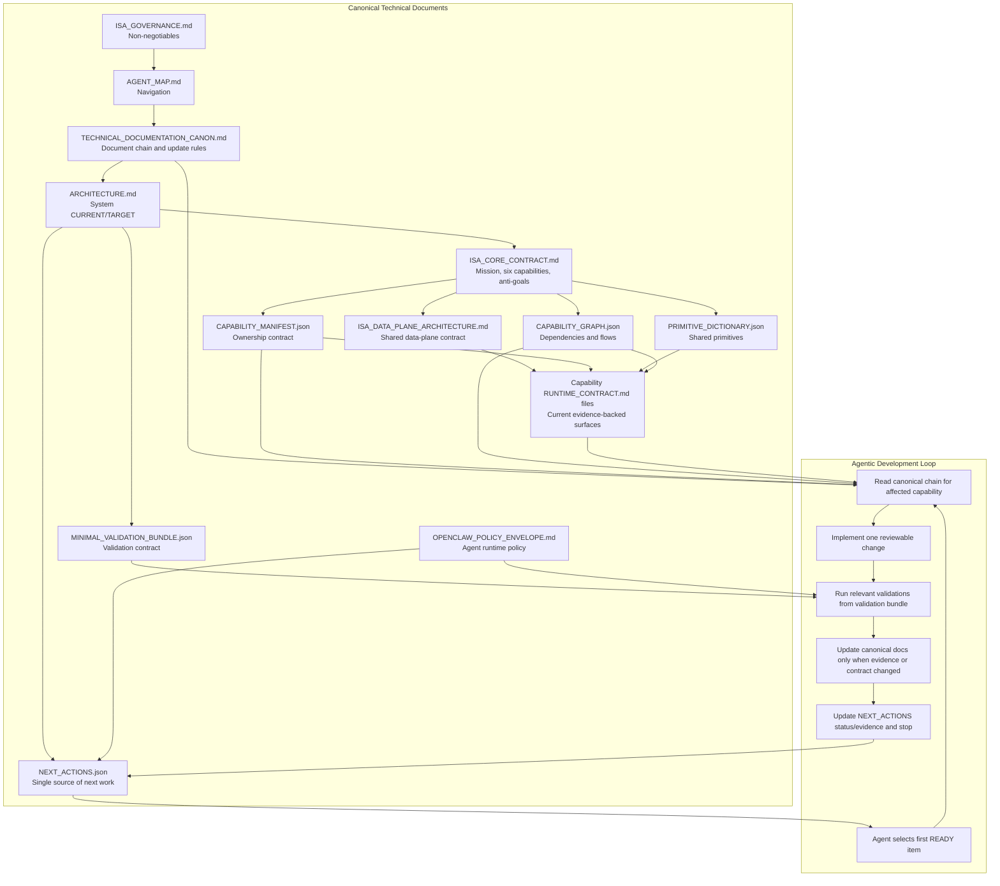

Status: CANONICAL
Last Updated: 2026-03-04

# ISA Technical Documentation Canon

## Purpose
This document defines the minimum canonical technical documentation set for ISA, how the documents relate, and how they are used inside the agentic development loop.

## Canonical Set

| Scope | Document | Role |
| --- | --- | --- |
| Governance root | `docs/governance/_root/ISA_GOVERNANCE.md` | Repository-wide non-negotiables and authority model |
| Navigation | `docs/agent/AGENT_MAP.md` | Entry map for humans and agents |
| Technical canon | `docs/governance/TECHNICAL_DOCUMENTATION_CANON.md` | Canonical technical document chain and update rules |
| System contract | `docs/spec/ARCHITECTURE.md` | Single `CURRENT` / `TARGET` architecture contract |
| Data plane contract | `docs/spec/ISA_DATA_PLANE_ARCHITECTURE.md` | Shared storage, provenance, retrieval, and engine policy contract |
| Core capability contract | `docs/spec/ADVISORY/ISA_CORE_CONTRACT.md` | Six-capability model, mission, ownership rule, anti-goals |
| Ownership contract | `docs/architecture/panel/_generated/CAPABILITY_MANIFEST.json` | Capability ownership of routers, tables, modules |
| Primitive contract | `docs/architecture/panel/_generated/PRIMITIVE_DICTIONARY.json` | Shared primitives promoted out of capability ownership |
| Dependency contract | `docs/architecture/panel/_generated/CAPABILITY_GRAPH.json` | Cross-capability dependencies and flows |
| Runtime contracts | `docs/spec/*/RUNTIME_CONTRACT.md` | Current evidence-backed runtime surface per capability |
| Validation contract | `docs/architecture/panel/_generated/MINIMAL_VALIDATION_BUNDLE.json` | Minimal validation bundle and confidence model |
| Execution queue | `docs/planning/NEXT_ACTIONS.json` | Single source of next work |
| OpenClaw envelope | `docs/governance/OPENCLAW_POLICY_ENVELOPE.md` | Agent runtime policy boundary for OpenClaw |

## Reading Order
1. `docs/governance/_root/ISA_GOVERNANCE.md`
2. `docs/agent/AGENT_MAP.md`
3. `docs/governance/TECHNICAL_DOCUMENTATION_CANON.md`
4. `docs/spec/ARCHITECTURE.md`
5. `docs/spec/ADVISORY/ISA_CORE_CONTRACT.md`
6. `docs/spec/ISA_DATA_PLANE_ARCHITECTURE.md`
7. `docs/architecture/panel/_generated/CAPABILITY_MANIFEST.json`
8. `docs/architecture/panel/_generated/PRIMITIVE_DICTIONARY.json`
9. `docs/architecture/panel/_generated/CAPABILITY_GRAPH.json`
10. Relevant `docs/spec/*/RUNTIME_CONTRACT.md`
11. `docs/architecture/panel/_generated/MINIMAL_VALIDATION_BUNDLE.json`
12. `docs/planning/NEXT_ACTIONS.json`
13. `docs/governance/OPENCLAW_POLICY_ENVELOPE.md`

## Relationship Rules
- `ARCHITECTURE.md` is the only canonical system-level `CURRENT` / `TARGET` contract.
- `ISA_CORE_CONTRACT.md` defines what ISA is for, what the six capabilities are, and what ISA is not.
- `ISA_DATA_PLANE_ARCHITECTURE.md` defines the shared storage, provenance, retrieval, and engine-policy substrate. It does not reassign capability ownership or redefine product architecture.
- `CAPABILITY_MANIFEST.json` wins for ownership disputes.
- `PRIMITIVE_DICTIONARY.json` wins when a concept is genuinely cross-capability.
- `CAPABILITY_GRAPH.json` wins for dependency and flow questions.
- Runtime contracts describe the current evidence-backed surfaces of each capability. They do not redefine system architecture.
- `NEXT_ACTIONS.json` is the only canonical next-work queue.
- `OPENCLAW_POLICY_ENVELOPE.md` governs how agents operate on the repo; it does not define product architecture.

## Canonical Product Shape
ISA is a GS1-centered actionable compliance advisor with five product layers:
- `Authority backbone`: `CATALOG`
- `Evidence retrieval backbone`: `KNOWLEDGE_BASE`
- `Decision core`: `ESRS_MAPPING`
- `User operating surface`: `ASK_ISA` and `NEWS_HUB` feeding a compliance cockpit
- `Stakeholder deliverables`: `ADVISORY`

## Agentic Loop

## Legacy And Supplemental Rules
- Historical and exploratory documents must not be used as architecture authority.
- Large historical architecture narratives should be reduced to short redirect documents once the canonical replacement exists.
- Duplicate runtime contracts should be reduced to redirect stubs until inbound references reach zero.
- New technical truth should be merged into the canonical set above, not added as parallel architecture, roadmap, or target-state documents.

## Documents Explicitly Not Used As Architecture Authority
- `docs/spec/ISA_CAPABILITY_MAP.md`
- `docs/spec/ADVISORY/ARCHITECTURE.md`
- `docs/spec/ADVISORY/FILE_SYSTEM_MEMORY_ARCHITECTURE.md`
- `docs/ISA_STRATEGIC_CONTEXT_SYNTHESIS.md`
- `docs/ISA_STRATEGIC_DISCOVERY_REPORT.md`
- `docs/ISA_STRATEGIC_EVALUATION_QUALITY_MAPPING.md`
- `docs/ISA_IMPLEMENTATION_EXECUTION_PLAN.md`
- `docs/spec/ADVISORY/ISA_FUTURE_DEVELOPMENT_PLAN.md`

## Update Policy
- Update `ARCHITECTURE.md` when system `CURRENT`, `TARGET`, or deltas change.
- Update `ISA_CORE_CONTRACT.md` when capability mission, anti-goals, or ownership semantics change.
- Update `ISA_DATA_PLANE_ARCHITECTURE.md` when shared storage, provenance, retrieval, or engine policy materially changes.
- Update machine contracts when repo reality changes.
- Update runtime contracts when a capability surface or owned data shape materially changes.
- Update `NEXT_ACTIONS.json` whenever the next canonical work item changes.
